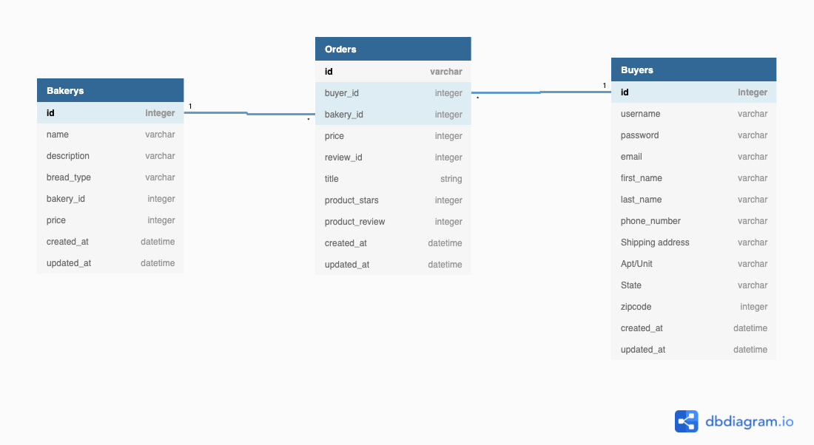

Wire frame
https://excalidraw.com/#json=5681204200210432,tE8KGQL-9xSIT-DzI0vPqg

MVP
https://docs.google.com/document/d/111vFXhQJRSIoFi9UzvUDZzW4rReBZendnTuPeM8XvCk/edit
# README

bundle install

This README would normally document whatever steps are necessary to get the
application up and running.

Things you may want to cover:

- Ruby version
  2.74

- System dependencies

- Configuration

- Database creation
  Postgresql

- Database initialization

- How to run the test suite

- Services (job queues, cache servers, search engines, etc.)

- Deployment instructions

- ...
  https://dbdiagram.io/d/6174b5bb6239e146477f6004

SQL ModelCREATE TABLE `Bakerys` (
`id` integer PRIMARY KEY,
`name` varchar(255),
`description` varchar(255),
`bread_type` varchar(255),
`bakery_id` integer,
`price` integer,
`created_at` datetime,
`updated_at` datetime
);

CREATE TABLE `Orders` (
`id` varchar(255) PRIMARY KEY,
`user_id` integer,
`bakery_id` integer,
`price` integer,
`review_id` integer,
`title` string,
`product_stars` integer,
`product_review` integer,
`created_at` datetime,
`updated_at` datetime
);

CREATE TABLE `Users` (
`id` integer PRIMARY KEY,
`username` varchar(255),
`password` varchar(255),
`email` varchar(255),
`first_name` varchar(255),
`last_name` varchar(255),
`phone_number` varchar(255),
`Shipping address` varchar(255),
`Apt/Unit` varchar(255),
`State` varchar(255),
`zipcode` integer,
`created_at` datetime,
`updated_at` datetime
);

ALTER TABLE `Orders` ADD FOREIGN KEY (`bakery_id`) REFERENCES `Bakerys` (`id`);

ALTER TABLE `Orders` ADD FOREIGN KEY (`user_id`) REFERENCES `Users` (`id`);

Terminal
rails new store_api --api database=postgresql --minimal --skip-javascript -T
bundle install

Uncomment
Gemfile --> gem cors 
config/cors.rb line 8 and below change origins 'example.com' to origins '\*'

Terminal
git checkout -b branch (automatically created repo w/ rails)
****root directory *****  npx create-react-app client --use-npm

npm uninstall -g create-react-app

Tests
Terminal 1      rails s
Terminal 2      npm start --prefix client
Do they start on diferent servers?

*extension GitLens - see commits, branches, different repos
*View -->Open then drag and drop the views to the side bar

Questions
??? node_modules don't display - Is this client in a seperate repository
https://github.com/jaenwawe/store-front

https://docs.github.com/en/github/importing-your-projects-to-github/importing-source-code-to-github/adding-an-existing-project-to-github-using-the-command-line

Created User Controller/Model/DB Migration  
rails generate resource User username password email first_name last_name phone_number address unit state zipcode:integer

To Do -check sql model below
Store  
rails generate resource Store ......
Test Rails c

Confirmation
rails generate resource Confirmation user:belongs_to store:belongs_to..... product_rating:integer detailed_review:text
rails generate resource
Test Rails c

Add Associations (has_many, dependent:destroy
Add Validations e.g. no blank password/email minimum with password email must have @

Rails db:migrate

Check Routes
